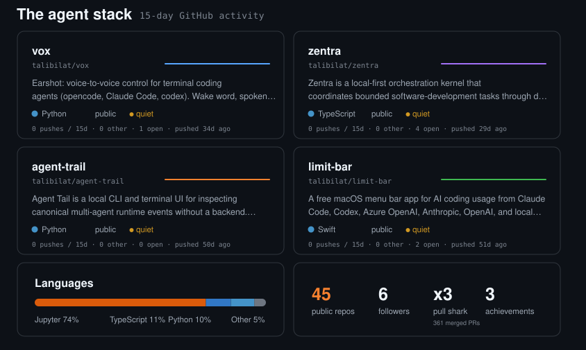

## Contribution graph

[Zoe](https://github.com/talibilat/Zoe-Jarvis-) · [Vox](https://github.com/talibilat/vox) · [Zentra](https://github.com/talibilat/zentra) · [Agent Trail](https://github.com/talibilat/agent-trail)

[View the dashboard data](./assets/agent-stack.json)

## Applied AI

<table>
<tr>
<td width="50%">

**[Job Search Intelligence](https://github.com/talibilat/job-search-intelligence)**

</td>
<td width="50%">

**[Resume Matcher](https://github.com/talibilat/Resume-Matcher)**

</td>
</tr>
</table>

